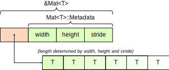
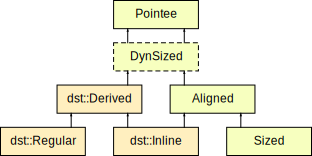

- Feature Name: `dyn-type`
- Start Date: 2018-11-12
- RFC PR: (leave this empty)
- Rust Issue: (leave this empty)

# Summary
[summary]: #summary

Support custom DSTs with size and alignment known at runtime, by reducing them into a built-in DST.

```rust ,ignore
// Custom fat pointer.
pub struct MatMeta {
    width: usize,
    height: usize,
    stride: usize,
}
pub dyn type Mat<T>(regular: MatMeta) = [T];

// Specify how to reduce to a slice, which regulates the DST's behavior.
impl<T> dst::Regular for Mat<T> {
    fn reduce_with_metadata(meta: MatMeta) -> usize {
        meta.len()
    }
}

// Most operations are safe
impl<T> Mat<T> {
    pub fn iter_mut<'a>(&'a mut self) -> impl Iterator<Item = &'a mut T> {
        let meta = ptr::metadata(self);
        let slice = dst::reduce_mut(self); // slice is a `&'a mut [T]`
        slice.chunks_mut(meta.stride).flat_map(|c| &mut c[..meta.width])
    }
}

// Custom thin pointer.
pub dyn type CStr(inline) = [u8];

// Mostly unsafe, but still very convenient.
unsafe impl dst::Inline for CStr {
    unsafe fn reduce_with_ptr(ptr: *const ()) -> usize {
        strlen(ptr as *const c_char) + 1
    }
}
impl CStr {
    fn to_bytes(&self) -> &[u8] {
        let content = unsafe { dst::reduce_unchecked(self) };
        &content[..(content.len() - 1)]
    }
}
```

<details><summary>Table of contents</summary>

<!-- TOC -->

- [Summary](#summary)
- [Motivation](#motivation)
- [Guide-level explanation](#guide-level-explanation)
    - [Tutorial](#tutorial)
        - [Dynamic sized types](#dynamic-sized-types)
        - [The case for custom DSTs](#the-case-for-custom-dsts)
        - [Creating custom DSTs](#creating-custom-dsts)
        - [Using the DST](#using-the-dst)
        - [Unsizing](#unsizing)
    - [Examples](#examples)
        - [Matrix](#matrix)
            - [Bounds on metadata](#bounds-on-metadata)
            - [Indexing a matrix](#indexing-a-matrix)
            - [Boxing a matrix](#boxing-a-matrix)
        - [CStr](#cstr)
        - [Multi-trait object](#multi-trait-object)
        - [Aligned pointer thinning](#aligned-pointer-thinning)
        - [Flexible array member](#flexible-array-member)
        - [Unaligned pointer thinning](#unaligned-pointer-thinning)
        - [Bit-array slice](#bit-array-slice)
- [Reference-level explanation](#reference-level-explanation)
    - [Changes](#changes)
        - [Core traits](#core-traits)
        - [Core functions](#core-functions)
        - [Syntax](#syntax)
        - [Semantics](#semantics)
        - [Size and alignment](#size-and-alignment)
        - [Drop](#drop)
        - [Unsize](#unsize)
    - [Details](#details)
        - [What do we want to support?](#what-do-we-want-to-support)
        - [Choosing the syntax](#choosing-the-syntax)
        - [Customizing size and alignment](#customizing-size-and-alignment)
        - [Reduction and regular/inline DST](#reduction-and-regularinline-dst)
        - [Aliasing](#aliasing)
        - [Unsizing](#unsizing-1)
        - [Interaction with RFC #1909](#interaction-with-rfc-1909)
- [Drawbacks](#drawbacks)
    - [Size of fat pointer is changed](#size-of-fat-pointer-is-changed)
    - [Complicated trait hierarchy](#complicated-trait-hierarchy)
    - [More potential panicking sites](#more-potential-panicking-sites)
    - [Unsafety](#unsafety)
    - [Non-sized DSTs unsupported](#non-sized-dsts-unsupported)
- [Rationale and alternatives](#rationale-and-alternatives)
    - [Rationales](#rationales)
        - [Variance of custom DST](#variance-of-custom-dst)
        - [Safety](#safety)
    - [Alternatives](#alternatives)
        - [Generalizing indexing](#generalizing-indexing)
        - [Pointer family](#pointer-family)
        - [Generalized metadata](#generalized-metadata)
    - [Bikeshed](#bikeshed)
        - [Naming](#naming)
            - [Module `core::dst`](#module-coredst)
            - [Trait `dst::Regular`](#trait-dstregular)
            - [Trait `dst::Inline`](#trait-dstinline)
            - [Trait `dst::Derived`](#trait-dstderived)
            - [Function `reduce`](#function-reduce)
        - [Alternative syntax](#alternative-syntax)
- [Prior art](#prior-art)
    - [Previous RFCs](#previous-rfcs)
    - [C and C++](#c-and-c)
- [Unresolved questions](#unresolved-questions)
    - [Safe construction](#safe-construction)
- [Future possibilities](#future-possibilities)
    - [`DynSized`](#dynsized)
    - [`#[repr]` as a constraint](#repr-as-a-constraint)
        - [Aligned foreign type](#aligned-foreign-type)
    - [Copy initialization](#copy-initialization)

<!-- /TOC -->

</details>

# Motivation
[motivation]: #motivation

As of Rust 1.31, we only have 4 families of DSTs:
slices (`[T]` and `str`), trait objects (`dyn Trait`), extern types and structs/tuples with a DST tail.
However this is not enough, e.g. we cannot easily define a length-prefix array or a 2D matrix slice with this.
And recently this even leads to attempt trying to stabilize extern types with questionable semantics
(e.g. fixing the alignment to be 1 even if it is completely opaque) to make custom DSTs possible.
This RFC is submitted to providing a proper way to define a true custom DST,
such that the internals can be safely defined.

See the [What do we want to support?](#what-do-we-want-to-support) section for more details.

# Guide-level explanation
[guide-level-explanation]: #guide-level-explanation

## Tutorial

> Even if this is a “guide-level” explanation, readers are still expected to understand what is a dynamic-sized type
> and why slices `&[T]` and trait objects `&dyn Trait` are implemented as [fat pointers].
>
> These can be referred in TRPL 2/e [§4.3], [§17.2], and also Rustonomicon [§2.2].

[§4.3]: https://doc.rust-lang.org/book/second-edition/ch04-03-slices.html
[§17.2]: https://doc.rust-lang.org/book/second-edition/ch17-02-trait-objects.html
[§2.2]: https://doc.rust-lang.org/nomicon/exotic-sizes.html
[fat pointers]: https://www.google.com/search?tbm=isch&q=fat+pointer

### Dynamic sized types

Dynamic-sized types (DSTs) are types where the memory structure cannot be sufficiently determined at compile time.
Memory structure means the allocation size, data alignment, destructor, etc. To know these,
pointers to DSTs will need to carry additional *metadata* to supplement the calculation at runtime.
In Rust there are two built-in DSTs:

* Slices `[T]` and string slice `str` — you need to know how long the slice is, so the metadata is the slice length.
* Trait objects `dyn Trait` — you need to know the concrete type, so the metadata is information about the type itself
    (size, alignment, destructor function pointer, and trait vtable).

Introducing DSTs in Rust allows us to separate the concern of “where to place these memory as a whole” vs
“how to use the content in this memory region”.
This allows, e.g. slices to be easily supported by any resource management schemes, be it a raw pointer `*const [T]` or `*mut [T]`,
shared reference `&[T]`, owned box `Box<[T]>`, ref-counted container `Rc<[T]>`,
and even third-party smart pointers like `Gc<'root, [T]>`.

### The case for custom DSTs

Slices and trait objects are not flexible enough for every use case. Sometimes you need to define your own *custom DST*.
An example is a 2D matrix. If we do not have custom DSTs, we would represent a rectangular sub-matrix as

```rust ,ignore
struct MatrixRef<'a, T> {
    elements: &'a [T],
    width: usize,
    height: usize,
    stride: usize,
}
```

This structure is not scalable to additional smart pointers —
you’ll need a `BoxMatrix<T>` to support elements stored in a `Box<[T]>`, a `RcMatrix<T>` for elements in `Rc<[T]>`, etc.
One may attempt to turn this type into a DST itself by storing elements as a flexible array member
at the end of the structure:

```rust ,ignore
struct MatrixData<T> {
    width: usize,
    height: usize,
    stride: usize,
    elements: [T],
}
```

This, however, has a problem that cannot be sub-sliced,
because `Index` requires you to return a reference without allocation!

```rust ,ignore
impl<T> Index<(Range<usize>, Range<usize>)> for MatrixData<T> {
    type Output = Self;
    fn index(&self, index: (Range<usize>, Range<usize>)) -> &Self {
        // Ok, how could you obtain a sub-matrix of `self`
        // while placing the `width`, `height`, `stride` members
        // in the correct position?
        //
        // Try it. No, it is impossible without allocation.
        panic!()
    }
}
```

The correct way is to make the width, height, and stride metadata themselves, placed outside of the elements array:

```rust ,ignore
#[derive(Copy, Clone)]
struct MatMeta {
    width: usize,
    height: usize,
    stride: usize,
}
magic!{"
    declare a custom DST `Mat<T>`,
    then somehow convince the compiler to treat every `*Mat<T>` as `(*T, MatMeta)`
"}
```

### Creating custom DSTs

Starting from Rust 1.XX, we are allowed to define custom DSTs with arbitrary metadata:

```rust
dyn type Mat<T>(regular: MatMeta) = [T];
```

This tells the compiler that:

* The pointer itself will carry a metadata represented by the type `MatMeta`.
* The type is a *regular DST*, explained below.
* A pointer to a matrix `*Mat<T>` can be safely *reduced* to the corresponding built-in DST `*[T]`.
    The metadata `MatMeta` of `Mat<T>` can be converted into the corresponding metadata of `[T]`
    (`usize`, the length of the slice).

In memory it looks like this:



We can calculate the actual size of the matrix using the width, height and stride alone:

```rust ,ignore
impl MatMeta {
    const fn len(&self) -> usize {
        if self.height == 0 {
            0
        } else {
            (self.height - 1) * self.stride + self.width
        }
    }
}
```

and we call this kind of DSTs a *regular DST*. We provide the size by implementing the `std::dst::Regular` trait:

```rust ,ignore
impl<T> std::dst::Regular for Mat<T> {
    const fn reduce_with_meta(meta: MatMeta) -> usize {
        meta.len()
    }
}
```

### Using the DST

The metadata of our DST contains essential information on how to retrieve the elements.
It should be easily retrievable from a `&Mat<T>`. Some convenient functions can be found in `std::ptr` module,
e.g. we could extract the metadata via `std::ptr::metadata`:

```rust ,ignore
use std::ptr;

impl<T> Mat<T> {
    pub fn width(&self) -> usize {
        ptr::metadata(self).width
    }
}
```

Accessing the content could be via by *reducing* the custom DST back into a built-in DST.

```rust ,ignore
use std::{ptr, dst};

impl<T> Mat<T> {
    pub fn iter<'a>(&'a self) -> impl Iterator<Item = &'a T> {
        let meta = ptr::metadata(self);
        let slice = dst::reduce(self); // convert `&Mat<T>` into `&[T]`
        slice.chunks(meta.stride).flat_map(|c| &c[..meta.width])
    }

    pub fn iter_mut<'a>(&'a mut self) -> impl Iterator<Item = &'a mut T> {
        let meta = ptr::metadata(self);
        let slice = dst::reduce_mut(self); // convert `&mut Mat<T>` into `&mut [T]`
        slice.chunks_mut(meta.stride).flat_map(|c| &mut c[..meta.width])
    }
}
```

### Unsizing

Built-in Rust DSTs like slice and trait objects support *unsize coercion*,
which allows you to turn a sized pointer into an unsized pointer:

```rust ,ignore
let array: &[u32; 4] = &[1, 2, 3, 4];
let slice: &[u32] = array;  // <-- coercion: `&[u32; 4]` becomes `&[u32]`!
```

This makes constructing a new DST much easier! Unsize coercion works by transforming the metadata
value (here, from `()` to `4`), and reinterpreting the pointed memory as the target type.

We could write these rules for our custom DSTs as well, through the `std::marker::Unsize` trait:

```rust ,ignore
unsafe impl<T, const width: usize, const height: usize> Unsize<Mat<T>> for [[T; width]; height] {
    fn unsize(_: ()) -> MatMeta {
        MatMeta {
            width,
            height,
            stride: width,
        }
    }
}
```

Unsizing works not just between sized and unsized types, it can be done between two DSTs too!

```rust ,ignore
unsafe impl<T: const width: usize> Unsize<Mat<T>> for [[T; width]] {
    fn unsize(height: usize) -> MatMeta {
        MatMeta {
            width,
            height,
            stride: width,
        }
    }
}
```

These allows us to e.g. create a boxed matrix through unsizing:

```rust ,ignore
let matrix: Box<Mat<u32>> = Box::new([
    [1, 0, 0, 0],
    [0, 1, 0, 0],
    [0, 0, 1, 0],
    [0, 0, 0, 1],
]);
```

## Examples

### Matrix

We have gone through the implementation of matrix in the [tutorial](#tutorial).
Here we list some other important information about the matrix DST.

#### Bounds on metadata

The metadata type is required to be `Copy + Sized + Send + Sync + Ord + Hash + Unpin`. Usually `#[derive]` is enough.

```rust ,ignore
#[derive(Copy, Clone, PartialEq, Eq, PartialOrd, Ord, Hash)]
pub struct MatMeta {
    width: usize,
    height: usize,
    stride: usize,
}
```

#### Indexing a matrix

The whole reason why matrix needs to be a DST in the first place.
First let’s see how we implement normal indexing for a single element.

```rust ,ignore
impl<T> Index<(usize, usize)> for Mat<T> {
    type Output = T;
    fn index(&self, index: (usize, usize)) -> &T {
        let meta = ptr::metadata(self);
        assert!(index.0 < meta.width, "column index out of bounds");
        assert!(index.1 < meta.height, "row index out of bounds");
        let index = meta.to_linear_index(index.0, index.1);
        &dst::reduce(self)[index]
    }
}
```

Now try to fetch a rectangular sub-matrix:

```rust ,ignore
impl<T> Index<(Range<usize>, Range<usize>)> for Mat<T> {
    type Output = Self;
    fn index(&self, index: (Range<usize>, Range<usize>)) -> &Self {
        let meta = ptr::metadata(self);
        assert!(index.0.start <= index.0.end, "invalid column range");
        assert!(index.0.end <= meta.width, "column index out of bounds");
        assert!(index.1.start <= index.1.end, "invalid row range");
        assert!(index.1.end <= meta.height, "row index out of bounds");

        let start_index = meta.to_linear_index(index.0.start, index.1.start);
        unsafe {
            let ptr = (self as *const T).add(start_index);
            &*<*const Mat<T>>::from_raw_parts(ptr as *const (), MatMeta {
                width: index.0.len(),
                height: index.1.len(),
                stride: meta.stride,
            })
        }
    }
}
```

Note that we still need unsafety (via pointer arithmetic and dereferencing) to create a sub-matrix.

#### Boxing a matrix

We could clone a `&Mat<T>` to a boxed `Box<Mat<T>>` by

1. Reducing the matrix to a slice
2. Boxing the slice
3. Extracts the raw pointers, and replace the slice metadata by the matrix’s.
4. Transmute the raw pointers back into a box.

```rust ,ignore
impl<'a, T: Copy + 'a> From<&'a Mat<T>> for Box<Mat<T>> {
    fn from(mat: &'a Mat<T>) -> Self {
        let meta = ptr::metadata(mat);
        let slice = dst::reduce(mat);
        let boxed = Box::<[T]>::from(slice);
        let raw = Box::into_raw(boxed);
        let raw = <*const Mat<T>>::from_raw_parts(raw as *const (), meta);
        unsafe { Box::from_raw(raw) }
    }
}
```

This method, however, will also copy the padding data between every row. We could choose to compact the matrix instead:

```rust ,ignore
impl<'a, T: Copy + 'a> From<&'a Mat<T>> for Box<Mat<T>> {
    fn from(mat: &'a Mat<T>) -> Self {
        let boxed = mat.iter().cloned().collect::<Vec<T>>().into_boxed_slice();
        let raw = Box::into_raw(boxed);
        let raw = <*const Mat<T>>::from_raw_parts(raw as *const (), MatMeta {
            width: mat.width(),
            height: mat.height(),
            stride: mat.width(),
        });
        unsafe { Box::from_raw(raw) }
    }
}
```

### CStr

`CStr` corresponds to a null-terminated string commonly used in C libraries. This is a thin pointer whose size is
retrieved by reading the content until seeing the first `'\0'`.

```rust ,ignore
#[repr(C)]
pub dyn type CStr(inline) = [u8];

unsafe impl dst::Inline for CStr {
    unsafe fn reduce_with_ptr(ptr: *const ()) -> usize {
        // need to '+1', the sentinel '\0' is part of the allocation.
        strlen(ptr as *const c_char) + 1
    }
}
```

Implementing some important functions...

```rust ,ignore
impl CStr {
    pub unsafe fn from_ptr<'a>(ptr: *const c_char) -> &'a CStr {
        // thin pointers can be directly cast between
        &*(ptr as *const CStr)
    }

    pub fn to_bytes(&self) -> &[u8] {
        let content = unsafe { dst::reduce_unchecked(self) };
        &content[..(content.len() - 1)]
    }
}
```

The content of a mutable `&mut CStr` is unsafe to access.
If we can safely use `&mut CStr`, we could rewrite the last byte of the content from `'\0'` to something else,
which would cause `CStr::to_bytes` constructing a slice beyond the allocated memory (buffer overflow).

### Multi-trait object

We could specify a custom DST which implements multiple traits like `dyn Read + Write`
by storing both vtables in the metadata.

```rust
pub dyn type DynReadWrite(regular: (<dyn Read>::Metadata, <dyn Write>::Metadata)) = dyn Read;

impl dst::Regular for DynReadWrite {
    fn reduce_with_metadata((meta, _): Self::Metadata) -> <dyn Read>::Metadata {
        meta
    }
}
```

We could safely reinterpret the custom DST as either `dyn Read` or `dyn Write`.

```rust
impl DynReadWrite {
    pub fn as_mut_read(&mut self) -> &mut dyn Read {
        dst::reduce_mut(self)
    }
    pub fn as_mut_write(&mut self) -> &mut dyn Write {
        let meta = ptr::metadata(self).1;
        unsafe { &mut *<*mut dyn Write>::from_raw_parts(self as *mut (), meta) }
    }
}
```

and for sure we could implement `Read` and `Write` on it.

```rust
impl Read for DynReadWrite {
    fn read(&mut self, buf: &mut [u8]) -> Result<usize> {
        self.as_mut_read().read(buf)
    }
    // ...
}
impl Write for DynReadWrite {
    fn write(&mut self, buf: &[u8]) -> Result<usize> {
        self.as_mut_write().write(buf)
    }
    // ...
}
```

Unsizing is crucial in constructing the DST.

```rust
unsafe impl<T: Read + Write> Unsize<DynReadWrite> for T {
    const fn unsize(_: ()) -> DynReadWrite::Metadata {
        let read_meta = <T as Unsize<dyn Read>>::unsize(());
        let write_meta = <T as Unsize<dyn Write>>::unsize(());
        (read_meta, write_meta)
    }
}
```

### Aligned pointer thinning

We can turn any aligned fat pointers into a thin pointer by inlining the metadata.
A thin array `Thin<[T]>` is a special case of this.

```rust ,ignore
pub struct ThinRepr<T: ?Sized + Aligned> {
    meta: T::Metadata,
    content: T,
}

pub dyn type Thin<T: ?Sized + Aligned>(inline) = ThinRepr<T>;

unsafe impl<T: ?Sized + Aligned> dst::Inline for Thin<T> {
    unsafe fn reduce_with_ptr(ptr: *const ()) -> T::Metadata {
        *(ptr as *const T::Metadata)
    }
}
```

One could recover the fat object from a thinned pointer.
The `DerefMut` here is *safe* because we are not touching the part that affects size information.

```rust ,ignore
impl<T: ?Sized + Aligned> Deref for Thin<T> {
    type Target = T;
    fn deref(&self) -> &T {
        unsafe { &dst::reduce_unchecked(self).content }
    }
}

impl<T: ?Sized + Aligned> DerefMut for Thin<T> {
    fn deref_mut(&mut self) -> &mut T {
        unsafe { &mut dst::reduce_mut_unchecked(self).content }
    }
}
```

We could also converts a fat object to a thin one, but it requires quite a lot of effort...

```rust ,ignore
impl<T: ?Sized + Aligned> From<T> for Box<Thin<T>> {
    fn from(content: T) -> Self {
        let meta = ptr::metadata(&content);
        let meta_layout = Layout::new::<T::Metadata>();
        let content_layout = Layout::for_value(&content);
        let (repr_layout, content_offset) = meta_layout.extend(content_layout).expect("layout overflow");
        unsafe {
            let repr_mem = alloc(repr_layout);
            ptr::write(repr_mem as *mut T::Metadata, meta);
            ptr::copy_nonoverlapping(
                &content as *const u8,
                repr_mem.add(content_offset),
                content_layout.size(),
            );
            mem::forget(content);
            Box::from_raw(repr_mem as *mut Thin<T>)
        }
    }
}
```

If unsized ADT expression and placement new are supported, most of the tricky unsafety can be removed.

```rust ,ignore
impl<T: ?Sized + Aligned> From<T> for Box<Thin<T>> {
    fn from(content: T) -> Self {
        let meta = ptr::metadata(&content);
        let repr = box ThinRepr { meta, content };
        unsafe {
            Box::from_raw(Box::into_raw(repr) as *mut Thin<T>)
        }
    }
}
```

### Flexible array member

In C we often use a flexible array member (a.k.a. unsized array) to denote inline data, e.g.

```c
typedef struct {
    int count;
    int result_flags;
    _nc_event *events[];
} _nc_eventlist;
```

This can be translated to Rust as an inline DST:

```rust
#[repr(C)]
pub struct ReprOf__nc_eventlist {
    count: c_int,
    result_flags: c_int,
    events: [*mut _nc_event],
}

#[repr(C)]
pub dyn type _nc_eventlist(inline) = ReprOf__nc_eventlist;

unsafe impl dst::Inline for _nc_eventlist {
    unsafe fn reduce_with_ptr(ptr: *const ()) -> usize {
        let ptr = <*const ReprOf__nc_eventlist>::from_raw_parts(ptr, 0);
        ptr.count as usize
    }
}
```

We could allow read-only access to individual fields via reduction.

```rust
impl Deref for _nc_eventlist {
    type Target = ReprOf__nc_eventlist;
    fn deref(&self) -> &ReprOf__nc_eventlist {
        unsafe { dst::reduce(self) }
    }
}
```

However, like `CStr` we cannot allow mutable access, since modifying the `count` field will change the allocation size.

### Unaligned pointer thinning

Note that the above requires the fat pointer by *aligned*. This excludes trait objects.
We could workaround by calculating the offset ourselves to satisfy the alignment requirement.
First, our representation is going to be encoded as raw bytes:

```rust ,ignore
pub struct UnalignedThinRepr<T: ?Sized> {
    meta: T::Metadata,
    start: usize,
    len: usize,
    content: [u8],
}
```

The range field allows the content is float off to satisfy the required alignment.
For instance, if `T` as 16-byte alignment, its offset would depend on the pointer position of the allocation itself.

```text
0       8      16      24      32      40      48      56      64
+-------+-------+-------+-------+-------+-------+-------+-------+
|  meta |   8   |  40   |        XXXXXXXXXXXXXXXXXXXXXXXXXXXXXXX|
+-------+-------+-------+-------+-------+-------+-------+-------+
                        0       8      16      24      32      40

        8      16      24      32      40      48      56      64      72
        +-------+-------+-------+-------+-------+-------+-------+-------+
        |  meta |   0   |  40   |XXXXXXXXXXXXXXXXXXXXXXXXXXXXXXX        |
        +-------+-------+-------+-------+-------+-------+-------+-------+
                                0       8      16      24      32      40

               16      24      32      40      48      56      64      72      80
                +-------+-------+-------+-------+-------+-------+-------+-------+
                |  meta |   8   |  40   |        XXXXXXXXXXXXXXXXXXXXXXXXXXXXXXX|
                +-------+-------+-------+-------+-------+-------+-------+-------+
                                        0       8      16      24      32      40
```

```rust ,ignore
impl<T: ?Sized> UnalignedThinRepr<T> {
    fn as_ptr(&self) -> *const T {
        let ptr = self.content[self.start..].as_ptr();
        <*const T>::from_raw_parts(ptr, self.meta)
    }
}
impl<T: ?Sized> Drop for UnalignedThinRepr<T> {
    fn drop(&mut self) {
        unsafe {
            drop_in_place(self.as_ptr() as *mut T);
        }
    }
}

pub dyn type UnalignedThin<T: ?Sized>(inline) = UnalignedThinRepr<T>;

unsafe impl<T: ?Sized + Aligned> dst::Inline for UnalignedThin<T> {
    unsafe fn reduce_with_ptr(ptr: *const ()) -> usize {
        let repr = <*const UnalignedThinRepr<T>>::from_raw_parts(ptr, 0);
        repr.len
    }
}

impl<T: ?Sized> Deref for UnalignedThin<T> {
    type Target = T;
    fn deref(&self) -> &T {
        unsafe { &*dst::reduce_unchecked(self).as_ptr() }
    }
}
impl<T: ?Sized> DerefMut for UnalignedThin<T> { ... }
```

Now we can implement the fat → thin converter.
The crucial operation which guarantees alignment is the `align_offset` method.

```rust ,ignore
impl<T: ?Sized> From<T> for Box<UnalignedThin<T>> {
    fn from(content: T) -> Self {
        let meta = ptr::metadata(&content)
        let prefix_layout = Layout::new::<(T::Metadata, usize, usize)>();
        let content_layout = Layout::for_value(&content);
        let (repr_layout, content_offset) = meta_layout.extend(content_layout).expect("layout overflow");
        unsafe {
            let repr_mem = alloc(repr_layout);
            let content_ptr = repr_mem.add(content_offset);
            let extra_offset = content_ptr.align_offset(content_layout.align());
            ptr::copy_nonoverlapping(
                &content as *const u8,
                content_ptr.add(extra_offset),
                content_layout.size(),
            );
            mem::forget(content);
            let repr = <*mut UnalignedThinRepr<T>>::from_raw_parts(repr_mem, 0);
            ptr::write(&mut repr.meta, meta);
            ptr::write(&mut repr.start, extra_offset);
            ptr::write(&mut repr.len, content_layout.size());
            Box::from_raw(repr_mem as *mut UnalignedThin<T>)
        }
    }
}
```

### Bit-array slice

A pointer can only address bytes, but we could address individual bits by augmenting the bit position.
Hence we could represent a bit slice via DSTs.

```text
                    1 1 1 1 1 1 1
0 1 2 3 4 5 6 7 8 9 0 1 2 3 4 5 6
+-+-+-+-+-+-+-+-+-+-+-+-+-+-+-+-+            len = 2 bytes
|     [~~~~~~~~~|~~~~~~~~~~~)   |      start_bit = 3
+-+-+-+-+-+-+-+-+-+-+-+-+-+-+-+-+        end_bit = 14
0               1               2
```

```rust ,ignore
#[derive(Copy, Clone, PartialEq, Eq, PartialOrd, Ord, Hash)]
pub struct BitSliceMeta {
    start_bit: usize, // inclusive, and must be in the range 0..=7
    end_bit: usize, // exclusive
}

pub dyn type BitSlice(regular: BitSliceMeta) = [u8];

impl dst::Regular for BitSlice {
    fn reduce_with_metadata(meta: BitSliceMeta) -> usize {
        (meta.end_bit + 7) / 8
    }
}
```

Toggle individual bits:

```rust ,ignore
impl BitSlice {
    fn set(&mut self, index: usize, value: bool) {
        let meta = ptr::metadata(self);

        // verify we aren't addressing out of range.
        let normalized_index = index + meta.start_bit;
        assert!(normalized_index < meta.end_bit);

        let byte_index = normalized_index / 8;
        let bit_index = normalized_index % 8;

        let byte = &mut dst::reduce_mut(self)[byte_index];
        if value {
            *byte |= 1 << bit_index;
        } else {
            *byte &= !(1 << bit_index);
        }
    }
}
```

Obtain a slice:

```rust ,ignore
impl Index<Range<usize>> for BitSlice {
    type Output = Self;
    fn index(&self, range: Range<usize>) -> &Self {
        if range.is_empty() {
            return &[];
        }

        let meta = ptr::metadata(self);

        let normalized_start = range.start + meta.start_bit;
        let normalized_end = range.end + meta.start_bit;
        assert!(normalized_start <= normalized_end && normalized_end <= meta.end_bit);

        let start_byte_index = normalized_start / 8;
        let slice = &dst::reduce(self)[start_byte_index..];

        let start_bit = normalized_start & 7;
        let end_bit = start_bit + range.len();

        unsafe {
            &*<*const BitSlice>::from_raw_parts(
                slice.as_ptr() as *const (),
                BitSliceMeta { start_bit, end_bit },
            )
        }
    }
}
```

A bit-slice **cannot** be mutably sliced, however. This is because our architecture only support byte-level addressing.
If we mutate a bit, we need to copy the whole byte first.
So, even if two bit-slices are logically non-overlapping at bit-level,
their ends may still overlap at byte-level and would cause memory unsafety when mutated simultaneously.

```text
+-+-+-+-+-+-+-+-+-+-+-+-+-+-+-+-+
|     [~~~~~~~~~|~~~~~~~~~~~)   |                   These two bit-slices are not overlapping at bit-level
+-+-+-+-+-+-+-+-+-+-+-+-+-+-+-+-+                   but are overlapping at byte-level.

                +-+-+-+-+-+-+-+-+-+-+-+-+-+-+-+-+
                |           [~~~|~~~~~~)        |
                +-+-+-+-+-+-+-+-+-+-+-+-+-+-+-+-+
```

# Reference-level explanation
[reference-level-explanation]: #reference-level-explanation

## Changes

This section provides instructions what needs to be added and changed in the standard library, compiler and language
to implement this RFC.

This RFC relies heavily on [RFC #2580].

### Core traits

We need the `core::marker::Pointee` trait from [RFC #2580], automatically implemented for all types:

```rust ,ignore
#[lang = "pointee"]
#[fundamental]
pub trait Pointee {
    type Metadata: Sized + Copy + Send + Sync + Ord + Hash + Unpin + 'static;
}
pub trait Thin = Pointee<Metadata = ()>;
```

Create a `core::dst` module, re-exported as `std::dst`.

Introduce the `core::dst::Derived` trait,
automatically implemented for all custom DSTs specified in this RFC (explained in the [Syntax](#syntax) section):

```rust ,ignore
#[lang = "dst_derived"]
pub unsafe trait Derived {
    type Reduced: ?Sized;
    unsafe fn reduce_metadata(val: *const Self) -> Self::Reduced::Metadata;
}
```

Introduce the `core::dst::Regular` trait:

```rust ,ignore
#[lang = "dst_regular"]
pub trait Regular: Derived {
    const fn reduce_with_metadata(metadata: Self::Metadata) -> Self::Reduced::Metadata;
}
```

Introduce the `core::dst::Inline` trait:

```rust ,ignore
#[lang = "dst_inline"]
pub unsafe trait Inline: Derived + Aligned + Thin {
    unsafe fn reduce_with_ptr(ptr: *const ()) -> Self::Reduced::Metadata;
}
```

The above traits should *not* appear inside `std::prelude::v1::*`.

Introduce the `core::marker::Aligned` marker trait:

```rust ,ignore
#[unstable(feature = "dyn_type", issue = "999999")]
#[lang = "aligned"]
#[rustc_on_unimplemented = "`{Self}` does not have a constant alignment known at compile-time"]
#[fundamental]
pub trait Aligned {}
```

Modify the `core::marker::Sized` marker trait to:

```rust ,ignore
#[stable(feature = "rust1", since = "1.0.0")]
#[lang = "sized"]
#[rustc_on_unimplemented = "`{Self}` does not have a constant size known at compile-time"]
#[fundamental]
pub trait Sized: Aligned {}
//               ^~~~~~~ new
```

Trying to implement `Pointee`, `Derived`, `Aligned` or `Sized` should emit error [E0322]
*“explicit impls for the trait are not permitted”*. Only `Regular` and `Inline` are designed to be customized.

[E0322]: https://doc.rust-lang.org/error-index.html#E0322



Pointers and references `&T` will be represented as the pair `(&(), T::Metadata)` in memory.

`Pointee` is a default bound which *cannot be opt-out* (similar to `std::any::Any`).
Writing `<T: ?Sized>` would still result in `T: Pointee`,
except that the members of the traits are not visible until explicitly `use`d.
As an example, the following should type-check:

```rust ,ignore
fn g<T: Pointee + ?Sized>();
fn f<T: ?Sized>() { g::<T>() }
```

### Core functions

Include the following core functions in `core::ptr::*`, according to [RFC #2580].

```rust ,ignore
pub fn metadata<T: ?Sized>(ptr: *const T) -> T::Metadata;

impl<T: ?Sized> *const T {
    pub fn from_raw_parts(data: *const (), meta: T::Metadata) -> Self;
}
impl<T: ?Sized> *mut T {
    pub fn from_raw_parts(data: *mut (), meta: T::Metadata) -> Self;
}
impl<T: ?Sized> NonNull<T> {
    pub fn from_raw_parts(data: NonNull<()>, meta: T::Metadata) -> Self;
}
```

Introduce the following new functions in `core::dst::*` as well:

```rust ,ignore
// Reduction on general custom DSTs are unsafe
pub unsafe fn reduce_ptr_unchecked<T: Derived + ?Sized>(val: *const T) -> *const Self::Reduced {
    let ptr = val as *const ();
    let meta = T::reduce_metadata(val);
    Self::from_raw_parts(ptr, meta)
}
pub unsafe fn reduce_mut_ptr_unchecked<T: Derived + ?Sized>(val: *mut T) -> *mut Self::Reduced { ... }
pub unsafe fn reduce_non_null_unchecked<T: Derived + ?Sized>(val: NonNull<T>) -> NonNull<Self::Reduced> { ... }
pub unsafe fn reduce_unchecked<T: Derived + ?Sized>(val: &T) -> &Self::Reduced { ... }
pub unsafe fn reduce_mut_unchecked<T: Derived + ?Sized>(val: &mut T) -> &mut Self::Reduced { ... }

// Reduction on regular DSTs are safe
pub fn reduce_ptr<T: Regular + ?Sized>(val: *const T) -> *const Self::Reduced {
    unsafe { reduce_ptr_unchecked(val) }
}
pub fn reduce_mut_ptr<T: Regular + ?Sized>(val: *mut T) -> *mut Self::Reduced { ... }
pub fn reduce_non_null<T: Regular + ?Sized>(val: NonNull<T>) -> NonNull<Self::Reduced> { ... }
pub fn reduce<T: Regular + ?Sized>(val: &T) -> &Self::Reduced { ... }
pub fn reduce_mut<T: Regular + ?Sized>(val: &mut T) -> &mut Self::Reduced { ... }
```

### Syntax

Introduce a new kind of item.

```rust ,ignore
ItemKind =
    ... |
    CustomDst:{
        "dyn" "type"
        name:IDENT
        generics:Generics?
        "(" custom_dst_kind:CustomDstKind ")"
        where_clause:WhereClause?
        "=" ty:Type ";"
    };

CustomDstKind =
    "regular" ":" ty:Type |
    "inline";
```

Syntactical examples:

```rust ,ignore
#[repr(C)]
pub dyn type CStr(inline) = [u8];

dyn type Mat<T>(regular: MatMeta) = [T];

dyn type Thin<P: ?Sized>(inline)
where
    P: Aligned,
= (P::Metadata, P);
```

### Semantics

When creating a *regular DST*, the compiler will automatically generate:

```rust ,ignore
dyn type RegDst<T, U>(regular: RegMeta<T, U>)
where
    T: Bounds<U>,
= ReducedTy<T, U>;

// implies:

impl<T, U> core::marker::Pointee for RegDst<T, U>
where
    T: Bounds<U>,
{
    type Metadata = RegMeta<T, U>;
}

unsafe impl<T, U> core::dst::Derived for RegDst<T, U>
where
    T: Bounds<U>,
{
    type Reduced = ReducedTy<T, U>;
    unsafe fn reduce_metadata(val: *const Self) -> Self::Reduced::Metadata {
        let meta = core::ptr::metadata(val);
        <Self as core::dst::Regular>::reduce_with_metadata(meta)
    }
}
```

When creating an *inline DST*, the compiler will automatically generate:

```rust ,ignore
dyn type InlineDst<T, U>(inline)
where
    T: Bounds<U>,
= ReducedTy<T, U>;

// implies:

impl<T, U> core::marker::Pointee for InlineDst<T, U>
where
    T: Bounds<U>,
{
    type Metadata = ();
}

unsafe impl<T, U> core::dst::Derived for InlineDst<T, U>
where
    T: Bounds<U>,
{
    type Reduced = ReducedTy<T, U>;
    unsafe fn reduce_metadata(val: *const Self) -> Self::Reduced::Metadata {
        <Self as core::dst::Inline>::reduce_with_ptr(val as *const ())
    }
}
```

Users are expected to `core::dst::Regular` and `core::dst::Inline` themselves.
Failing to do so should result in the normal [E0277] *“the trait bound is not satisfied”* error at the declaration site.

```
error[E0277]: the trait bound `CStr: std::dst::Inline` is not satisfied
  --> src/lib.rs:11:9
   |
11 | pub dyn type CStr(inline) = [u8];
   |                   ^^^^^^ the trait `std::dst::Inline` is not implemented for `CStr`
```

[E0277]: https://doc.rust-lang.org/error-index.html#E0277

The variance of the generic parameters `T`, `U` will be the same as the tuple `(Self::Reduced, Self::Metadata)`.

If `Self::Reduced` implements an auto-trait (e.g. `Send`/`Sync`), the custom DST itself will also implement it
(`Self::Metadata` is not considered).

The `#[repr]` attributes can be applied on custom DSTs.

* With `#[repr(align(n))]`, the `align_of` and `align_of_val` methods will always return `n`,
    and `Aligned` is always implemented regardless of `Self::Reduced`.
* With `#[repr(C)]` on an inline DST, the type is FFI-safe.
    `#[repr(C)]` on regular DST will cause error [E0517] *“attribute should be applied to struct, enum or union”*.
* Everything else (packed, simd, transparent) causes [E0517] error.

[E0517]: https://doc.rust-lang.org/error-index.html#E0517

Supporting `#[derive]` on custom DSTs is not required by this RFC.

### Size and alignment

The bounds of the `align_of` intrinsic is relaxed to

```rust ,ignore
pub fn align_of<T: Aligned + ?Sized>() -> usize;
//                 ^~~~~~~~~~~~~~~~ relaxed
```

| Type | align_of |
|------|-------|
| `#[repr(align(n))]` | `n` |
| `#[repr(packed)]` | 1 |
| Sized type | (same as before) |
| Slices `[T]` | `align_of::<T>()` |
| `str` | 1 |
| Trait object | *not implemented* |
| Extern type | *not implemented* |
| DST structs/tuples | max of all fields, if all of them are aligned |
| Custom DST | `align_of::<Self::Reduced>()`, if the reduced type is aligned |

Ensure `size_of::<&T>()` returns the size of the tuple `(usize, T::Metadata)`.

The `size_of_val` and `align_of_val` of a custom DST is equal to its reduction.

| Type | size_of_val |
|------|-------------|
| Sized type | `size_of::<T>()` |
| Slices `[T]` | `val.len() * size_of::<T>()` |
| `str` | `val.len()` |
| Trait object | `metadata(val).size()` |
| Extern type | abort |
| DST structs/tuples | (some complicated calculations) |
| Custom DST `dyn type` | `size_of_val(reduce(val))` |

| Type | align_of_val |
|------|--------------|
| Aligned type | `align_of::<T>()` |
| Trait object | `metadata(val).align()` |
| Extern type | abort |
| DST structs/tuples | max of all fields |
| Custom DST | `align_of_val(reduce(val))` |

### Drop

Relax bounds for the `needs_drop` intrinsic to check DSTs.

```rust
fn needs_drop<T: ?Sized>() -> bool;
//               ^~~~~~ relaxed
```

If `T` does not implement `Drop`, depending on the DST family, this function's return value is:

| Family         | Result                      |
|----------------|-----------------------------|
| Slices (`[T]`) | Same as `needs_drop::<T>()` |
| `str`          | false                       |
| Trait object   | true                        |
| Extern type    | false                       |
| Custom DST     | Same as `needs_drop::<T::Reduced>` |

The `drop_in_place` for custom DST will work by dropping its reduction in place.

```rust ,ignore
pub unsafe fn drop_in_place_for_derived<T: Derived + ?Sized>(val: *mut T) {
    drop_in_place(reduce_ptr_mut(val));
}
```

A custom DST itself cannot implement `Drop`.
Custom drop implementation should be done through its reduction, to prevent repeatedly dropping the same fields.

### Unsize

Modify `core::marker::Unsize` trait to:

```rust ,ignore
#[unstable(feature = "unsize", issue = "27732")]
#[lang = "unsize"]
pub unsafe trait Unsize<T: ?Sized> {
    const fn unsize(meta: Self::Metadata) -> T::Metadata; // <-- new
}
```

Error [E0328] *"explicit impls for the `Unsize` trait are not permitted"* should be removed.
Implementing `Unsize` is now allowed.

[E0328]: https://doc.rust-lang.org/error-index.html#E0328

Unsize-coercion from `*const Src` to `*const Dest` would perform the following:

```rust ,ignore
let src_meta = metadata(src);
let dest_meta = <Src as Unsize<Dest>>::unsize(src_meta);
unsafe { <*const Dest>::from_raw_parts(src as *const (), dest_meta) }
```

Ensure the compiler can handle unsize-coercion between two DSTs, not just from sized to unsized.

To avoid infinite reduction, unsize-coercion should never be applied more than once in the whole coercion chain.

## Details

This section provides an in-depth description about how custom DST is designed to the current form.

### What do we want to support?

“Custom DST” as a concept itself is not precise enough.
If we just say we want to “allow customizing the metadata type and `size_of_val` function” without going into details,
we may make the design too narrow, or accidentally block more general applications, or even worse,
leads ourselves into inconsistency. Here we first list all scenarios we want this RFC to achieve.

0. Be compatible with existing attempts towards custom DSTs, including

    * [RFC #2580]  (introduced the `Pointee` trait to extract metadata of a DST)
    * [RFC #1909]  (allow DSTs be passed “by value”)

1. Support 2D matrix `Mat<T>`, the first canonical example when introducing custom DST.

    * This means a custom DST must be generic, which leads to the question of *variance*.
    * We want to be able to coerce `&[[T; m]; n]` → `&Mat<T>`, similar to `&[T; m]` → `&[T]`,
        which means we should allow *custom unsizing*.

2. Support thin C string `CStr`, the second canonical example when introducing custom DST.

    * There was [overwhelming support][Pre-RFC #6258] to make `CStr` thin.
    * Unlike other DSTs, the `size_of_val` of `CStr` can only be computed by inspecting the memory content.
    * C strings are supposed to be passed to C libraries, and thus we should consider how custom DST works with *FFI*.

3. Support bit slice (indicated by [this comment][RFC #1524/comment 5527]).

4. Support Pascal strings, length-prefixed arrays, and C-style flexible array structures.

5. Support turning most fat pointers into thin pointers (inspired by [this comment][RFC #1909/comment 1432]).

6. Allows a stopgap experimentation for multi-trait objects like `&dyn (Read + Write)`
    before choosing the actual representation in the language itself.

7. Ensure existing code taking `T: ?Sized` keep compiling even after introducing custom DSTs.

8. Reduce the need of `unsafe` annotations when working with custom DST.

    * This means we restrict the flexibility of custom DSTs so that the compiler can impose safety checks on it.

[Pre-RFC #6258]: https://internals.rust-lang.org/t/pre-rfc-make-cstr-a-thin-pointer/6258
[RFC #1524/comment 5527]: https://github.com/rust-lang/rfcs/pull/1524#issuecomment-281415527
[RFC #1909/comment 1432]: https://github.com/rust-lang/rfcs/pull/1909#issuecomment-330901432

### Choosing the syntax

While there are many different DST examples,
the memory content of all of these can be safely expressed as an ordinary DST struct:

```rust ,ignore
struct Mat<T>([T]);
struct CStr([c_char]);
struct BitSlice([u8]);
struct PArray<T>(usize, [T]);
struct Thin<T: ?Sized>(T::Metadata, T);
struct ReadWrite(dyn Read);
```

What makes custom DST different is just their metadata.

We opt for declaring a custom DST using a dedicated syntax,
unlike [RFC #1524] which expresses this via a normal struct declaration + an impl,
since being a custom DST is a property of the type itself. This is similar to the auto trait syntax,
changing from a normal trait + `impl Trait for ..` to a dedicated syntax `auto trait Trait {}`.

Our custom DST should provide their custom metadata, and the underlying DST struct representation.
Therefore we choose our first syntax like this:

```rust ,ignore
dyn type CStr(()) = [c_char];
//            ^~    ^~~~~~~~
//             |     underlying representation
//             |
//             metadata

dyn type Mat<T>(MatMeta) = [T];
//              ^~~~~~~    ^~~
//                    |     underlying representation
//                    |
//                    metadata
```

“`dyn`” is picked because it means dynamic,
and recently becomes a keyword thanks to `dyn Trait` ([RFC #2113]),
so we don’t need to introduce another unconstrained contextual keyword.
Adding a `type` makes it spell out “dynamic type”, as well as preventing potential misinterpretation as a `dyn Trait`.

### Customizing size and alignment

In the most flexible sense, the size and alignment of custom DSTs are arbitrary functions and will be provided by user.

```rust ,ignore
// not part of this RFC
trait CustomDst {
    fn size_of_val(&self) -> usize;
    fn align_of_val(&self) -> usize;
}
```

Now, while `std::mem::{size_of_val, align_of_val}` takes the whole DST reference as input,
it may not make sense for `align_of_val` to use its pointer as input. To wit, consider an unsized struct:

```rust ,ignore
struct S<T: ?Sized> {
    a: u8,
    b: T,
}
let s: &S<Dst> = ...;
let t: &Dst = &s.b;
```

To get the address `&s.b`, we first need to find out the offset of `b` in `S<Dst>`.
This requires knowing the alignment of `Dst`, which is `align_of_val(&s.b)`, and that leads to a circular dependency!
Hence, our `align_of_val` should not depend on the pointer part of the reference at all.

```rust ,ignore
// not part of this RFC
trait CustomDst {
    fn size_of_val(val: *const Self) -> usize;
    fn align_of_meta(meta: Self::Metadata) -> usize;
}
```

The alignment needs to read `Metadata` because of how trait objects are implemented.
Consider the types `*S<u8>` and `*S<u16>`.

```text
+=======+    +===============+
| S<u8> |    |    S<u16>     |
+=======+    +===============+
| a | b |    | a |   |   b   |
+---+---+    +---+   +-------+
0   1   2    0   1   2   3   4
```

Both types can be *coerced* into `*S<dyn Debug>`.
The type `S<dyn Debug>` itself does not tell us the alignment of field `b`.
This can only be obtained via the type information stored in the trait object’s metadata.

### Reduction and regular/inline DST

We want to be able to treat every aspect of the a DST as if the ordinary DST to maintain safety.
So what the user should provide is not `size_of_val`/`align_of_meta`,
but a function which produces the original DST which we compute the size and alignment from it instead.
We call such process *reduction*, and the custom DST is *derived* from that ordinary DST.

```rust ,ignore
unsafe trait Derived {
    type Reduced: ?Sized;
    unsafe fn reduced_metadata(val: *const Self) -> Self::Reduced::Metadata;
}
```

When we create a `dyn type`, the compiler should implement `Pointee` and `Derived` automatically,
and user just need to provide

```rust ,ignore
unsafe impl<T> Derived for Mat<T> {
    unsafe fn reduced_metadata(val: *const Self) -> usize { // the metadata of [T] is a usize, the length.
        ptr::metadata(val).len()
    }
}
```

The problem here is that we cannot forward `align_of_meta` to `reduced_meta`
since we don’t have `self` in the first place. This forces us to either

1. make `reduced_meta` take only `Self::Metadata`, or
2. make `align_of_meta` not rely on reduction i.e. the alignment is known at compile time.

We call the first kind of DST a *regular DST*. This covers slice, trait object, matrix, `OsStr`, and bit slice.
These types carry a nonzero metadata, and the reduction (and size) can be entirely derived from the metadata alone.

```rust ,ignore
trait Regular: Derived {
    fn reduce_with_metadata(meta: Self::Metadata) -> Self::Reduced::Metadata;
}
```

The second kind of DST are mainly thin DSTs like `CStr`, Pascal strings and length-prefixed arrays.
These types has no metadata and thus the pointer is thin and can be used in FFI.
The size can only be obtained by parsing the memory content itself, and thus we call these *inline DST*,
as in the metadata are stored “inline”.

```rust ,ignore
unsafe trait InlineDst: Derived + Aligned + Thin {
    unsafe fn reduce_with_ptr(ptr: *const ()) -> Self::Reduced::Metadata;
}
```

Only trait objects and foreign types have no compile-time alignment. To distinguish between these and other DSTs,
we’d like to introduce a new trait, `Aligned`, which marks the type as having a compile-time alignment.
This also has a nice side effect of relaxing the bounds of `core::mem::align_of`.

Since we want to distinguish between regular and inline DSTs, and modify the syntax for declaring a custom inline DST.

```rust
dyn type Mat<T>(regular: MatMeta) = [T];
//              ^~~~~~~~

dyn type CStr(inline) = [c_char];
//            ^~~~~~
```

### Aliasing

Representing custom DSTs through reduction allows the compiler to manipulate them as if normal Rust types,
but there is a potential hazard regarding borrow-checking.

Let’s revisit matrix. A matrix’s metadata consists of three numbers, the width, height and stride.
The stride can be larger than the width when the rectangular slice does not include all columns.

```
+----+----+====+====+----+  highlighted region:
|  0 |  1 [  2 |  3 ]  4 |      width = 2
+----+----+====+====+----+      height = 2
|  5 |  6 [  7 |  8 ]  9 |      stride = 5
+----+----+====+====+----+
| 10 | 11 | 12 | 13 | 14 |
+----+----+----+----+----+
```

In the linear representation as a `[T]`, it will contain `[2, 3, 4, 5, 6, 7, 8]`.
Note that the irrelevant entries `4, 5, 6` are included.
This means providing mutable access to the reduced type is unsafe.
Ideally we should represent this memory as `∃w,h,s: [([T; w], [Opaque<T>; s-w]); h]`,
but encoding this thing in the type system is just as error-prone as writing actual checking code,
and thus decided against doing this.

This also means even if we have two `&mut Mat<T>`, their memory may be physically overlapping,
although they are still logically disjoint.
It is hard to know what LLVM is going to do with two `noalias` pointers pointing at different but overlapping memory,
if it turns out to cause mis-compilation ([issue #31681]), we may need to remove `noalias` annotations for custom DSTs.

[issue #31681]: https://github.com/rust-lang/rust/issues/31681

### Unsizing

Unsizing is a kind of coercion between two smart pointers `*T` and `*U`
where both interprets the memory content in the same way, and `*U` is more general than `*T`.
Unsizing from `*T` to `*U` is mainly a way to fabricate a correct `U::Meta` value.

```rust ,ignore
impl<T, const n: usize> Unsize<[T]> for [T; n] {
    const UNSIZED_METADATA: usize = n;
}
```

In [RFC #401] where unsizing was first introduced, unsizing is implemented for:

* Arrays to slices (`[T; n]` → `[T]`)
* Concrete types to dynamic trait objects (`T` → `dyn Trait`)
* Sized struct to unsized struct (`(u8, T)` → `(u8, U)` where `T: Unsize<U>`)

With custom DST, we wish to allow custom unsizing as well,
for instance it should make sense to coerce any `[[T; m]; n]` to a `Mat<T>`.

```rust ,ignore
unsafe impl<T, const width: usize, const height: usize> Unsize<Mat<T>> for [[T; width]; height] {
    const UNSIZED_METADATA: MatMeta = MatMeta {
        width,
        height,
        stride: width,
    };
}
```

Furthermore, it also makes sense to “unsize” an already unsized type, `[[T; m]]` → `Mat<T>`. And
thus the custom metadata should be an associated function, not an associated constant.

```rust ,ignore
unsafe impl<T, const width: usize> Unsize<Mat<T>> for [[T; width]] {
    const fn unsize(height: Self::Metadata) -> MatMeta {
        MatMeta {
            width,
            height,
            stride: width,
        }
    }
}
```

Note that most unsizing implementations requires const generics ([RFC #2000]) to make sense.

### Interaction with RFC #1909

[RFC #1909]  (unsized rvalues) allows DSTs to be passed by value:

```rust ,ignore
fn accept_dst_by_value(f: dyn FnOnce()) {
    f()
}
```

This RFC is completely compatible with unsized rvalues:

1. Custom DSTs will be passed as if the tuple `(&move T, T::Metadata)`.

2. Local variables declared on stack will be allocated using `Layout::for_value` as usual,
    which is determined by `size_of_val` and `align_of_val`.
    This should produce a lint due to unbounded stack usage, however.

# Drawbacks
[drawbacks]: #drawbacks

## Size of fat pointer is changed

Currently an `&T` where `T: ?Sized` is always two-pointer long.
While this assumption is already broken by foreign types, it will be made worse by the introduction of custom DSTs,
where the size of `&T` can be anything.

If some code relies on `transmute` to do low-level manipulation of fat pointers, they will be broken.
This will be even more troublesome for standard types such as `CStr`.

## Complicated trait hierarchy

The trait hierarchy becomes much more complex after this RFC.

## More potential panicking sites

Allowing user to customize `align_of_val` and `unsize` is going to introduce places where a panic is least expected.
`align_of_val` will be used when finding the offset of a DST struct, meaning the following expression may panic:

```rust
struct Dst<T: ?Sized>(u8, T);

fn g<T: ?Sized>(a: &Dst<T>) -> &T {
    &a.1    // <-- may panic!
}
```

Similarly, unsize coercion would also panic:

```rust
unsafe impl Unsize<MyDst> for MyType {
    const fn unsize(_: ()) -> MyDst::Meta {
        panic!("oops!")
    }
}

let f = MyType;
let g: &MyDst = &f; // <-- panic!
```

## Unsafety

This RFC still does not specify how to safely create a custom DST other than unsizing.
Most code producing a custom DST thus are usually still unsafe.

## Non-sized DSTs unsupported

This RFC expects the DSTs still have a runtime size and alignment,
and thus unsuitable for types where this is completely undefined, e.g. a slice of LinkedList bounded by two cursors.

# Rationale and alternatives
[rationale-and-alternatives]: #rationale-and-alternatives

## Rationales

### Variance of custom DST

We treat the variance of `dyn type Dst<T>(regular: M) = C` as the same as that of `(C, M)`,
for simplicity in user’s understanding as well as correctness in implementation.

As an example showing why this is practically a better solution (even if wrong theoretically), consider a weird DST:

```rust ,ignore
dyn type Weird<T>(regular: PhantomData<T>) = [()];
```

Now check the type `&mut Weird<T>`. A `&mut` reference is invariant in its borrowed content.
However, this DST is actually represented as `(&mut (), PhantomData<T>)`, which is covariant!
This is totally unexpected to the reader.

To check the soundness, we compare `P<(C, M)>` and `(P<C>, M)` between different variances,
where `P` is a reference or pointer. We see the following results:

* If `P<T>` is covariant (e.g. `&T`), `P<(C, M)>` and `(P<C>, M)` have exactly the same variance.
* If `P<T>` is invariant (e.g. `&mut T`), `P<(C, M)>` is the more conservative choice.
* If `P<T>` is bivariant, `(P<C>, M)` is the more conservative choice.
* If `P<T>` is contravariant, the two choices are incompatible.

The last two cases (`P<T>` being bivariant or contravariant) are in fact irrelevant:

1. In Rust, no types can actually be bivariant, since it will cause error E0392 *“parameter is never used”*.
2. Built-in references and pointers are never contravariant.
3. The only built-in contravariant type, `fn(T)`, is always a thin pointer, thus irrelevant.
4. Custom “contravariant smart pointer” like `(PhantomData<fn(T)>, T::Metadata)` does not matter,
    since we are referring to `T::Metadata` explicitly, forcing `T` to be invariant.

Anyway, if these arguments are not convincing enough, or if we want to defy [RFC #738] and support declared variance…

```rust ,ignore
struct ContraPtr<#[contravariant] T: ?Sized>(*mut T);
```

… one could always issue an error when the metadata type is not invariant or bivariant.

```
error[E9999]: metadata type cannot use generic parameters with variance
 --> src/lib.rs:1:31
  |
1 | dyn type Weird<T>(regular: PhantomData<T>) = [()];
  |                            ^^^^^^^^^^^^^^
```

<details><summary>Enumeration of variances</summary>

| C | M | `P<(C, M)>` | `(P<C>, M)` | Note    |
|:-:|:-:|:-----------:|:-----------:|:--------|
| + | + | +P          | +P ∧ +      | `P<(C, M)>`’s variance is too loose (− or ∞) when `P` is − or ∞ |
| + | 0 | 0           | 0           |         |
| + | − | 0           | +P ∧ −      |         |
| + | ∞ | +P          | +P          |         |
| 0 | + | 0           | 0           |         |
| 0 | 0 | 0           | 0           |         |
| 0 | − | 0           | 0           |         |
| 0 | ∞ | 0           | 0           |         |
| − | + | 0           | −P ∧ +      |         |
| − | 0 | 0           | 0           |         |
| − | − | −P          | −P ∧ −      | `P<(C, M)>`’s variance is too loose (+ or ∞) when `P` is − or ∞ |
| − | ∞ | −P          | −P          |         |
| ∞ | + | +P          | +           | `P<(C, M)>` has opposite variance (−) when `P` is − |
| ∞ | 0 | 0           | 0           |         |
| ∞ | − | −P          | −           | `P<(C, M)>` has opposite variance (+) when `P` is − |
| ∞ | ∞ | ∞           | ∞           |         |

* \+ = covariant
* 0 = invariant
* − = contravariant
* ∞ = bivariant
* +P = variance of `P<T>`
* −P = contraposition of variance of `P<T>` (swap + and −)
* *x* ∧ *y* = [greatest-lower-bound]

[greatest-lower-bound]: https://github.com/rust-lang/rust/blob/53a6d14e5/src/librustc_typeck/variance/xform.rs

</details>

### Safety

This RFC introduced or modified 7 core traits. Out of which,
`dst::Inline` and `Unsized` are designated unsafe to implement, and `dst::Regular` is considered safe to implement.
The rest cannot be implemented manually and thus safety is irrelevant.

| Trait | Safety |
|-------|--------|
| Pointee | (sealed) |
| Aligned | (sealed) |
| Sized | (sealed) |
| dst::Derived | (sealed) |
| dst::Regular | safe |
| dst::Inline | unsafe |
| Unsize | unsafe |

`dst::Inline` is unsafe due to `reduce_with_ptr`. Suppose we can mutably access the content of `CStr`,
and the user writes or remove a `\0` somewhere, the size will be completely changed and causes buffer overflow.
`dst::Inline` types are extremely unsafe if the type allows unconstrained (exterior and interior) mutable access,
and the implementor must uphold the contract that *no safe code* can change the size via `&mut Self`.

This is also the reason the functions `dst::reduce_*_unchecked` are all unsafe, even the `&T -> &T::Reduced` one,
because `T::Reduced` may contain a Cell.

On the other hand, `dst::Regular` is safe. This is because the size information, recorded in the metadata,
is stored outside of the type’s memory space. Thus even with an `&mut Self` the size is still immutable.

`Unsize` is unsafe because we need to guarantee the source and target types have the same memory representation.

We require the functions `dst::Regular::reduce_with_metadata` and `Unsize::unsize` be `const`
to ensure the implementation is as pure as possible, to prevent scenarios like this:

```rust
impl dst::Regular for Shapeshifter {
    fn reduce_with_metadata(meta: Self::Metadata) -> usize {
        random()
    }
}
// allocating a `Box<Shapeshifter>` is going to be fun...
```

However, `const` method relies on [RFC #2237], which was closed in favor of a more ambitious effect-system RFC.
If `const` method is not available, we have no choice but to have `dst::Regular` an `unsafe` trait,
requiring implementation to prove that the function is indeed pure.

## Alternatives

### Generalizing indexing

Instead of introducing custom DSTs,
we may solve the “`Index` requires `&T`” problem by introducing the `IndexMove` trait ([RFC issue #997]):

```rust ,ignore
trait IndexMove<Idx> {
    type Output;
    fn index_move(self, idx: Idx) -> Self::Output;
}
```

With this, we can define slicing on a matrix reference as

```rust ,ignore
struct MatrixRef<'a, T: 'a> {
    elements: &'a [T],
    width: usize,
    height: usize,
    stride: usize,
}
impl<'a, T: 'a> Clone for MatrixRef<'a, T> { ... }
impl<'a, T: 'a> Copy for MatrixRef<'a, T> {}

impl<'a, T: 'a> IndexMove<(RangeFull, RangeFull)> for MatrixRef<'a, T> {
    type Output = Self;
    fn index_move(self, _: (RangeFull, RangeFull)) -> Self {
        self
    }
}
```

We can also implement it on an owned matrix:

```rust ,ignore
impl<'a, T: 'a> IndexMove<(RangeFull, RangeFull)> for &'a Matrix<T> {
    type Output = MatrixRef<'a, T>;
    fn index_move(self, _: (RangeFull, RangeFull)) -> MatrixRef<'a, T> {
        MatrixRef {
            elements: &self.elements,
            width: self.width,
            height: self.height,
            stride: self.width,
        }
    }
}
```

but the slice will need to be access through the strange syntax `let mr = (&m)[(.., ..)]`
instead of the more natural `let mr = &m[(.., ..)]`.
Furthermore, the latter syntax cannot be used to produce `mr: MatrixRef<T>`
since we expect the `&` operator to produce a reference, not a struct.

### Pointer family

One advantage of custom DST is usable to multitude of smart pointers. We could reproduce the same benefit using GATs.

First, introduce the *pointer family* trait:

```rust ,ignore
trait PointerFamily {
    type Pointer<T: ?Sized>;
    // note: not bounding with Deref since we want to support `*const T` as well.
}

struct ConstPtrFamily;
impl PointerFamily for ConstPtrFamily {
    type Pointer<T: ?Sized> = *const T;
}

struct RefFamily<'a>(PhantomData<&'a ()>);
impl<'a> PointerFamily for RefFamily<'a> {
    type Pointer<T: ?Sized> = &'a T;
}

struct RcFamily;
impl PointerFamily for RcFamily {
    type Pointer<T: ?Sized> = Rc<T>;
}

...
```

We could then define `Matrix<P>` as:

```rust ,ignore
struct Matrix<P: PointerFamily, T> {
    elements: P::Pointer<[T]>,
    width: usize,
    height: usize,
    stride: usize,
}
```

An advantage of GATs is ability to represent multiple pointers, e.g.

```rust ,ignore
struct Tensor<P: PointerFamily, T> {
    elements: P::Pointer<[T]>,
    ranges: P::Pointer<[(/*len*/usize, /*stride*/usize)]>,
}
```

and then we get `Tensor<RefFamily<'a>, T>`, `Tensor<BoxFamily, T>`, `Tensor<GcFamily<'root>, T>` etc,
all of which cannot be represented using custom DST (`&Tensor<T>`, `Box<Tensor<T>>`, `Gc<'root, Tensor<T>>`)
since the metadata type needs `Copy`.

(Note that such trick does not really depend on GATs.
For instance, `ndarray` is already using this approach in the [`ArrayBase` type][ndarray::ArrayBase],
though the implementation is not pretty without GATs.)

[ndarray::ArrayBase]: https://docs.rs/ndarray/0.11.0/ndarray/struct.ArrayBase.html

### Generalized metadata

The bounds for metadata type is currently too strict and too relaxed.
It is too strict since pointers like `*mut T` does not need `Send + Sync`,
and references like `&'a T` only needs `'a` lifetime instead of `'static`.
It is too relaxed since bounds like `UnwindSafe` is missing due to libstd/libcore separation.

Furthermore, as shown above, custom DST is useless for `ndarray`
as we cannot store the arbitrarily-long stride as a `Vec` is not `Copy`.

These can be solved if we make `Metadata` a GAT which takes a pointer family,
and allow the pointer family to specify what traits `Metadata` should bound for using associated trait bounds
([RFC issue #2190]).

```rust ,ignore
trait PointerFamily {
    trait MetaBounds;
    type Pointer<T: ?Sized>;
}

struct ConstPtrFamily;
impl PointerFamily for ConstPtrFamily {
    trait MetaBounds = Copy + Ord + Hash + UnwindSafe + 'static;
    type Pointer<T: ?Sized> = *const T;
}

struct RefFamily<'a>(PhantomData<&'a ()>);
impl<'a> PointerFamily for RefFamily<'a> {
    trait MetaBounds = Copy + Send + Sync + UnwindSafe + Unpin + 'a;
    type Pointer<T: ?Sized> = &'a T;
}

struct RcFamily;
impl PointerFamily for RcFamily {
    trait MetaBounds = Clone + UnwindSafe + Unpin + 'static;
    type Pointer<T: ?Sized> = Rc<T>;
}
```

```rust ,ignore
trait Pointee {
    type Metadata<P: PointerFamily>: Sized + P::MetaBounds;
}
```

and a `Box<Dst>` will be represented as `(Box<()>, Dst::Metadata<BoxFamily>)` in memory.
This allows us to write the high-dimensional tensor slice as

```rust ,ignore
impl Pointee for Tensor<T> {
    type Metadata<P: PointerFamily> = P::Pointer<[(usize, usize)]>;
}
```

Since we can’t implement `Pointee` directly, we need to introduce a third kind of DST syntax e.g.

```rust ,ignore
dyn type Tensor<T>(third_kind<P>: P<[(usize, usize)]>) = [T];
```

The problem of generalizing `Metadata` is that it will plague every API it touches, e.g.

```rust
fn metadata<T: ?Sized, P: PointerFamily>(dst: P::Pointer<T>) -> T::Metadata<P>;
//                     ^~~~~~~~~~~~~~~~       ^~~~~~~~~~~~~                ^~~
fn unsize<P: PointerFamily>(metadata: Self::Metadata<P>) -> T::Metadata<P>;
//        ^~~~~~~~~~~~~~~~                          ^~~                ^~~
// etc.
```

and thus makes custom DST very complicated to use. Also, generalizing `Metadata` may be a breaking change,
that means if we have stabilized one solution, we have to stick with it.

Should we generalize `Metadata`? We believe the answer is *no*.
`ndarray` is a pretty special case where the metadata itself is unsized, and even for tensors,
we could support it using a non-GAT `Metadata` by limiting the number of dimensions
(6 dimensions is enough for everyone). In fact,
the requirement of `ndarray` of supporting “parallel pointers” where a single `&T` type points to multiple,
separate objects (the tensor data and the strides) may worth a separate feature,
instead of shoehorning it on top of custom DST metadata.

## Bikeshed

This section lists some arbitrary decisions not related to the semantics.

### Naming

#### Module `core::dst`

A separate module is introduced to group concepts about custom DST into a single place.
Alternatively we could put the content in `core::marker` or `core::mem`.

#### Trait `dst::Regular`

This is called “regular” because all Rust types before introducing `extern type` can be described by this sizing method,
i.e. the size and alignment are computed using the metadata and type information alone.

It should not be called “fat” because `Sized` types also regular but are thin.

#### Trait `dst::Inline`

This is called “inline” because the sizing information is stored directly inline with the memory.

It should not be called “thin” because extern types are thin but are not inline; in fact it has undefined size.

#### Trait `dst::Derived`

This means a custom DST is *derived* from another DST.
Ideally the name should not start with “R” or “I” to maximize the distinction between the other two traits.

We could also call it “Custom” but it makes it awkward to introduce other kinds of custom DST not based on reduction.

#### Function `reduce`

The process of converting the custom DST into the underlying type is called “reduction”,
to convey that we are changing a fancier type to a more basic type.

### Alternative syntax

The custom DST declaration syntax proposed by this RFC is:

```rust ,ignore
dyn type Dst<T>(regular: M) where T: Bounds = C;
dyn type Dst<T>(inline) where T: Bounds = C;
```

This requires 2 words to introduce the item, similar to `extern crate` and `auto trait`.
While it is possible to just use `dyn Dst<T>(...)`,
we feel that it may have conflict with the trait object type syntax `dyn Fn(X, Y)`,
and thus the keyword `type` is inserted next to it.

As an alternative to `dyn type`, we could introduce two contextual keywords

```rust ,ignore
regular_dst Dst<T>(M) where T: Bounds = C;
inline_dst Dst<T> where T: Bounds = C;
```

Instead of contextual keywords, we could specify the kind of DST via sigils

```rust ,ignore
dyn type Dst<T>(M) where T: Bounds = C;
dyn type Dst<T>(..) where T: Bounds = C;
```

We could use other brackets and separators e.g.

```rust ,ignore
dyn type Dst<T>[regular = M](C) where T: Bounds;
```

We could place the metadata information after the `dyn` keyword
(but this makes metadata appears before where the generics are introduced)

```rust ,ignore
dyn(regular: M) type Dst<T> where T: Bounds = C;
dyn(inline) type Dst<T> where T: Bounds = C;
```

# Prior art
[prior-art]: #prior-art

## Previous RFCs

RFCs for custom DST has been proposed many times before but seldom bore any fruit due to the breadth of the topic.
Here we list all known previous proposals.

0. [DST, Take 5]  (2014 Jan 5th)
1. [RFC #709]: Truly unsized types (2015 Jan 23rd)
2. [@japaric’s draft]  (2015 Jul 2nd)
3. [RFC #1524]: Custom Dynamically Sized Types for Rust (2016 Mar 3rd)
4. [@kennytm’s draft]  (2018 Jan 11th)
5. [Pre-RFC #6663]: Let’s fix DSTs (2018 Jan 28th)
6. [RFC #2594]: Custom DSTs (2018 Nov 11th)

[DST, Take 5]: http://smallcultfollowing.com/babysteps/blog/2014/01/05/dst-take-5/
[@kennytm’s draft]: https://github.com/kennytm/rfcs/tree/dyn-type/text/0000-dyn-type
[@japaric’s draft]: https://github.com/japaric/rfcs/blob/unsized2/text/0000-unsized-types.md

There are also a lot of other RFCs to solve a subset of DST problems, including:

* [RFC #1909]: Unsized Rvalues
* [RFC #1993]: Opaque Data structs for FFI (first mention of `DynSized`)
* [RFC #2310]: Further evolution of `DynSized`
* [RFC #2580]: Pointer metadata & VTable (defines `Pointee`)

## C and C++

C99 provided “flexible array member” allowing the size of structure be determined dynamically.
However, C provides no means to safely check if the dynamically determined size equals to the allocated size.

There is an early C++ draft [P1039] extending flexible array member to become safer,
either by storing the size externally in a hidden field, or by overloading a method to specify an inline size.

```c
struct udp {
    uint16_t source_port;
    uint16_t destination_port;
    uint16_t data_size;
    uint16_t checksum;
    byte data[];    // <-- declare a flexible array member
};

namespace std {
    // specify the FAM size in a separate impl
    template<>
    struct fam_traits<udp> {
        constexpr static uint16_t size(const udp& u) {
            return u.data_size;
        }
    };
}
```

[P1039]: https://thephd.github.io/vendor/future_cxx/papers/d1039.html

# Unresolved questions
[unresolved-questions]: #unresolved-questions

## Safe construction

This RFC does not provide any solution for safely constructing a custom DST besides unsizing.
(In fact none of the previous RFC does.) Users need to provide their own safe abstraction.

Unsizing applies only to very limited cases. For instance, a `Box<CStr>` cannot be constructed through unsizing.

We do not know if there is a simple solution to reduce the unsafe surface to create a new DST instance.

# Future possibilities
[future-possibilities]: #future-possibilities

## `DynSized`

This RFC does not mandate the `DynSized` trait, as we are not implementing `size_of_val` of a custom DST directly,
but delegate through its reduced type. Therefore `DynSized` is out-of-scope of this RFC.

If we do have `DynSized` *before* custom DST is stabilized, there are several choices we could make:

* Make `DynSized` a super-trait of `dst::Derived`,
    making it impossible to create custom DST which reduces to an extern type.
* Keep the current `DynSized`less hierarchy unchanged.

Since the content of an extern type is completely opaque,
we do not expect it is useful to reduce a custom DST to an extern type.
Therefore, we recommend making `DynSized` a requirement of custom DST to provide more guarantees.

## `#[repr]` as a constraint

We may define *aligned trait objects*, in the form

```rust ,ignore
#[repr(align(n))]
trait AlignedTrait { ... }
```

This will make `dyn Trait` implement `Aligned`, where `align_of_val()` will return `n` instead of `meta.align`.

When `#[repr(align(n))]` is defined on a trait,
it is an error to implement such trait on types which alignment is not exactly `n`.

```rust ,ignore
#[repr(align(2))]
trait X {}

impl X for u8 {} // error
impl X for u16 {} // ok
impl X for u32 {} // error
```

In fact, we could extend this behavior to anywhere a generic bound is expected:

* Super-traits
* Generic parameters
* Associated types

```rust ,ignore
#[repr(align(2))]
trait T<#[repr(align(2))] U> {
    #[repr(align(2))]
    type V: PartialEq<U>,
}
```

An alternative design is specify this through a const generic condition

```rust ,ignore
trait X: Aligned
where
    const(align_of::<Self>() == 2)
{}
```

but the compiler will need to reverse engineer the expression to know that the alignment is a constant,
in order to implement `Aligned` for `dyn X`.

### Aligned foreign type

Similar to above, we could apply `#[repr(align(n))]` to an `extern type`:

```rust
extern {
    #[repr(align(n))]
    type Opaque;
}
```

This will make `align_of_val` return `n` instead of aborting/panicking.
However, it might still not able to implement `Aligned` because `Opaque` still is not `DynSized`,
and it is not worth it to break the assumption that `Aligned: DynSized`.

## Copy initialization

We are able to clone the content of a `[String]`, provided we have got a sufficiently large buffer.
Similarly, we can `memcpy` a `str` to an uninitialized buffer.
But we cannot implement `Clone` or `Copy` to them since they expect `Sized` types.

[RFC #1909] suggests to remove the `Sized` bound on `Clone`, but this is a breaking change.
Instead, we suggest providing a new pair of traits:

```rust ,ignore
trait CloneInit {
    /// Clones the content of `self` into an uninitialized buffer of sufficient size.
    unsafe fn clone_init(&self, buf: *mut u8);
}
unsafe trait CopyInit: CloneInit {}
```

with the following implementations:

```rust ,ignore
impl<T: Clone> CloneInit for T {
    unsafe fn clone_init(&self, buf: *mut u8) {
        ptr::write(buf, self.clone());
    }
}
impl<T: Clone> CloneInit for [T] {
    unsafe fn clone_init(&self, buf: *mut u8) {
        let buf = buf as *mut T;
        for (i, elem) in self.iter().enumerate() {
            ptr::write(buf.add(i), elem.clone());
        }
    }
}
impl<T: Clone> CloneInit for str {
    unsafe fn clone_init(&self, buf: *mut u8) {
        ptr::copy(self.as_ptr(), buf, self.len());
    }
}

unsafe impl<T: Copy> CopyInit for T {}
unsafe impl<T: Copy> CopyInit for [T] {}
unsafe impl CopyInit for str {}
```

Similar to the sized world, one should not simultaneously implement `CopyInit` and `Drop`.

Copy initialization allows one to trivially convert a reference into any smart pointer.

```rust ,ignore
impl<'a, T: CopyInit + ?Sized + 'a> From<&'a T> for Box<T> {
    fn from(src: &'a T) -> Self {
        let meta = ptr::metadata(src);
        let mem = alloc(Layout::for_value(src));
        unsafe {
            src.clone_init(mem);
            Box::from_raw(<*mut T>::from_raw_parts(mem as *mut (), meta))
        }
    }
}
```

<!-- Type conversions -->
[RFC #401]: https://github.com/rust-lang/rfcs/pull/401
<!-- RFC: truly unsized types -->
[RFC #709]: https://github.com/rust-lang/rfcs/pull/709
<!-- Support variance for type parameters -->
[RFC #738]: https://github.com/rust-lang/rfcs/pull/738
<!-- RFC: truly unsized types -->
[RFC issue #813]: https://github.com/rust-lang/rfcs/issues/813
<!-- Extending deref/index with ownership transfer: DerefMove, IndexMove, IndexSet -->
[RFC issue #997]: https://github.com/rust-lang/rfcs/issues/997
<!-- Custom Dynamically Sized Types for Rust -->
[RFC #1524]: https://github.com/rust-lang/rfcs/pull/1524
<!-- extern types -->
[RFC #1861]: https://github.com/rust-lang/rfcs/pull/1861
<!-- Unsized Rvalues -->
[RFC #1909]: https://github.com/rust-lang/rfcs/pull/1909
<!-- Opaque Data structs for FFI -->
[RFC #1993]: https://github.com/rust-lang/rfcs/pull/1993
<!-- Const generics -->
[RFC #2000]: https://github.com/rust-lang/rfcs/pull/2000
<!-- `dyn Trait` Syntax for Trait Objects: Take 2 -->
[RFC #2113]: https://github.com/rust-lang/rfcs/pull/2113
<!-- Associated traits -->
[RFC issue #2190]: https://github.com/rust-lang/rfcs/issues/2190
<!-- RFC: const bounds and methods -->
[RFC #2237]: https://github.com/rust-lang/rfcs/pull/2237
<!-- RFC: DynSized without ?DynSized — Lint against use of `extern type` in `size_of_val`, and more -->
[RFC #2310]: https://github.com/rust-lang/rfcs/pull/2310
<!-- RFC: Pointer metadata & VTable -->
[RFC #2580]: https://github.com/rust-lang/rfcs/pull/2580
<!-- RFC: Custom DSTs -->
[RFC #2594]: https://github.com/rust-lang/rfcs/pull/2594
<!-- Pre-eRFC: Let’s fix DSTs -->
[Pre-RFC #6663]: https://internals.rust-lang.org/t/pre-erfc-lets-fix-dsts/6663
